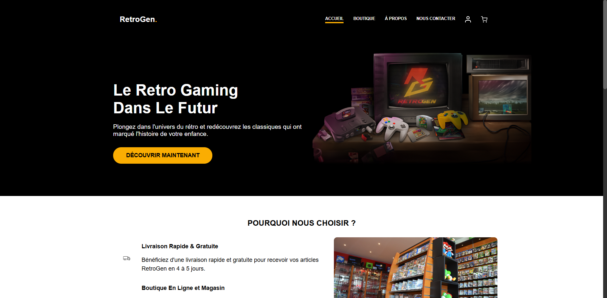
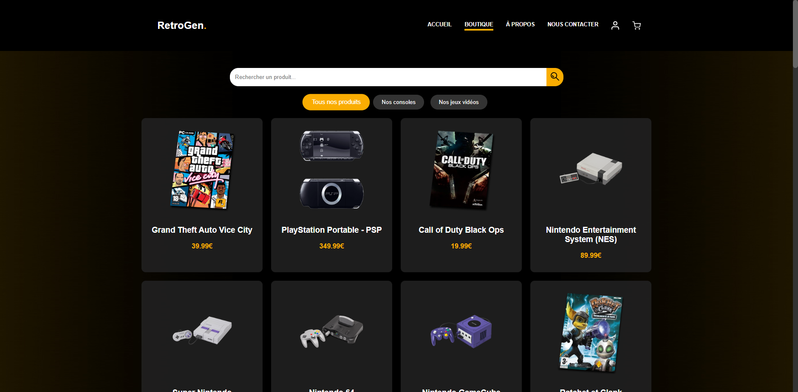
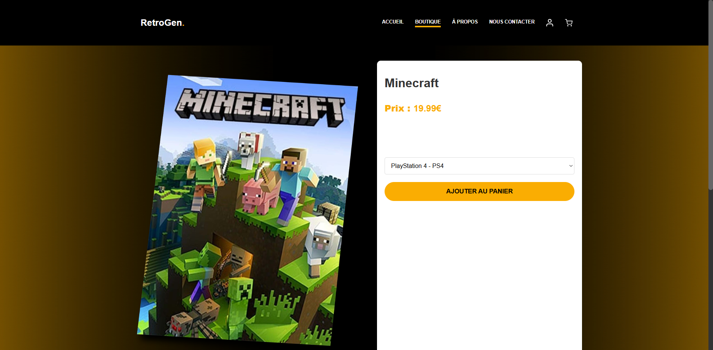
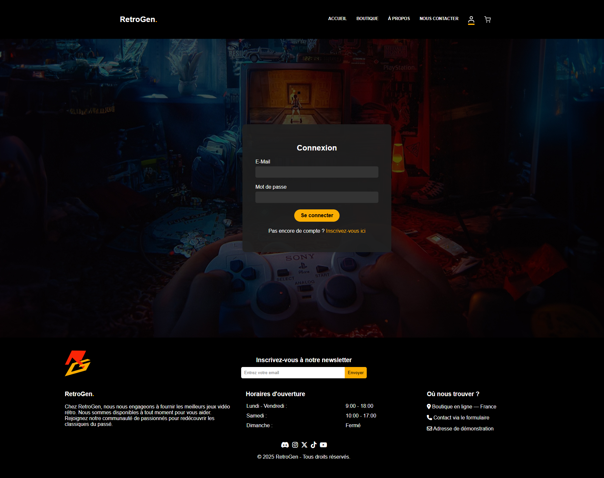

# RetroGen

RetroGen est une boutique de jeux vidéo rétro réalisée en Flask et SQLite dans le cadre d’un projet scolaire. L’application propose un catalogue, des fiches produits et un parcours de compte utilisateur.

## Fonctionnalités

- accueil et catalogue alimentés par SQLite ;
- recherche et filtrage par catégorie ;
- fiches produits avec choix de console ;
- inscription, connexion et mots de passe hachés ;
- commentaires et notes de 1 à 5 étoiles.

## Installation

```powershell
python -m venv .venv
.\.venv\Scripts\Activate.ps1
python -m pip install flask
python flask_app.py
```

Ouvrir ensuite `http://127.0.0.1:5000`. La base de démonstration est initialisée automatiquement et ignorée par Git pour ne pas publier de comptes locaux.

## État du projet

Prototype pédagogique. Les écrans panier et paiement sont encore statiques ; les protections d’un vrai commerce restent à ajouter.

## Captures

| Accueil | Boutique |
|---|---|
|  |  |

| Fiche produit | Connexion |
|---|---|
|  |  |
